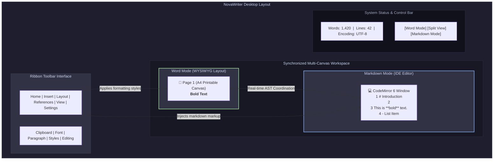
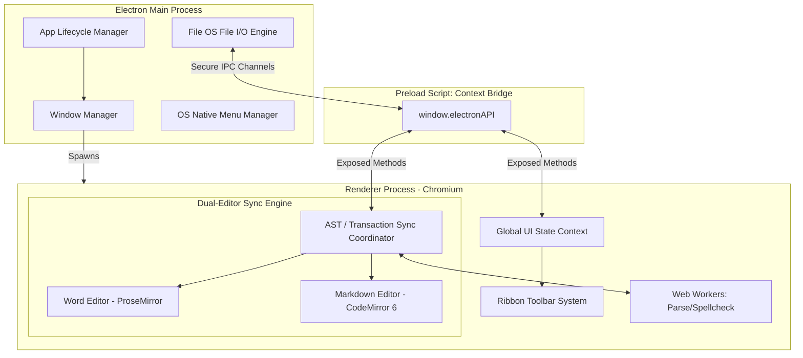
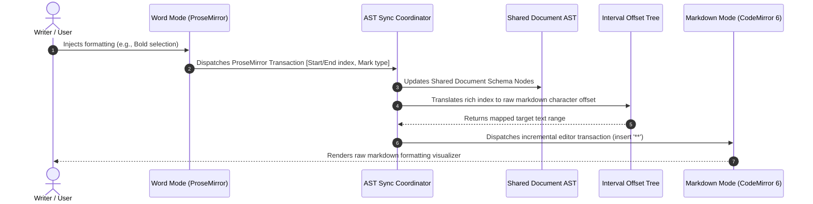
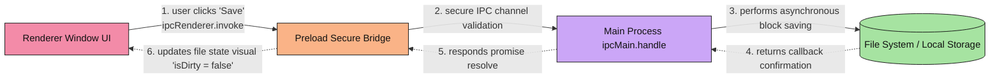
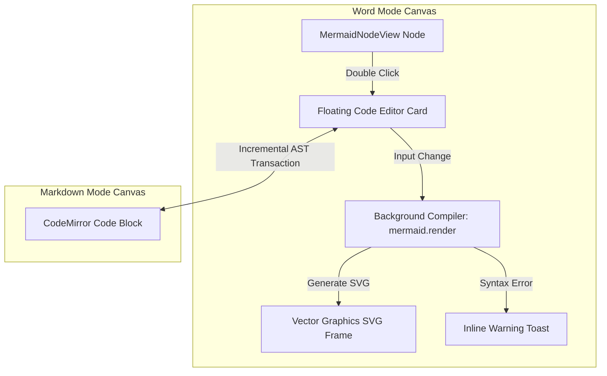
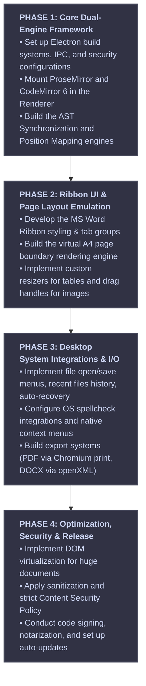

# ARCHITECTURAL BLUEPRINT: NOVAWRITER (A HIGH-FIDELITY HYBRID MARKDOWN WORD PROCESSOR)

An enterprise-grade, Electron-based desktop application architecture that merges the power of an extensible markdown engine with the high-fidelity WYSIWYG capabilities of a premium word processor like Microsoft Word.

---

## 1. Executive Summary & Product Vision

### The Paradigm Shift
Traditional markdown editors separate editing from previewing (split-screen) or offer simple "live previews" that lose markdown syntax visibility. Conversely, heavy word processors like Microsoft Word lock content into complex, proprietary binary formats (`.docx`). 

**NovaWriter** bridges this divide by establishing **Markdown (`.md`) as the single source of truth** while presenting the user with two synchronized, world-class interfaces:
1. **Word Processor Canvas ("Word Mode"):** A rich, paginated WYSIWYG editor featuring a responsive MS Word-style **Ribbon Interface**, A4/Letter page-by-page rendering, margins, and direct drag-and-drop elements.
2. **Structure & Code Editor ("Markdown Mode"):** A professional developer-grade IDE environment (inspired by VS Code) with syntax highlighting, line numbers, folding, invisible characters, and structural trees.

The engineering challenge is maintaining **100% roundtrip fidelity**—ensuring that toggle switches, formatting options, and real-time edits instantly sync between both editors without losing custom configurations, HTML blocks, or syntax subtleties.



---

## 2. Core Architectural Principles

To ensure this app performs with the speed, stability, and scalability of VS Code, it will adhere to the following architectural tenets:

*   **Process Isolation:** The Main process handles OS integrations (I/O, Menus, Dialogs, Window management). The Renderer process handles the UI. A secure, minimal IPC Bridge binds them.
*   **AST-Driven State Synchronization:** Synchronization is not done through fragile string diffing. We parse the document into an Abstract Syntax Tree (AST). Changes in either view update this central, stateful memory buffer.
*   **Zero Main-Thread Blocking:** File serialization, spellcheck initialization, PDF rendering, and complex Markdown parsing occur in asynchronous background Web Workers.
*   **System Native Integration:** The app integrates deeply with the operating system, supporting system file associations, native drag-and-drop, context menus, and hardware-accelerated rendering.

---

## 3. Technology Stack Selection

The stack has been carefully selected to match industry-standard best practices in 2026:

| Layer | Technology | Justification |
| :--- | :--- | :--- |
| **App Core** | **Electron + Node.js** | Provides native desktop window management, direct OS integration, high-performance IPC, and system-level file access. |
| **Renderer Framework** | **React (TypeScript)** | Enables a highly responsive, component-driven UI for the complex Ribbon toolbar and side panels. |
| **WYSIWYG Engine (Word Mode)** | **ProseMirror + TipTap Core** | ProseMirror is a structured, document-schema-based editor. It avoids standard contentEditable bugs and provides direct AST mapping. |
| **Code Editor (Markdown Mode)**| **CodeMirror 6** | A modern, highly extensible text editor designed for mobile and desktop browsers. Much lighter than Monaco, with better touch support and custom theme integrations. |
| **Markdown Parsing/AST** | **unified.js / remark** | The industry standard for parsing Markdown to an AST (mdast), allowing structural mutations and exact HTML/Markdown serialization. |
| **Styling & Theme Engine** | **Vanilla CSS Variables + Tailwind** | Allows dynamic theme switching (Light, Dark, Sepia, Solarized) with hardware-accelerated CSS custom properties. |
| **Export Services** | **@m2d/md2docx + Puppeteer Core** | Enables high-fidelity conversion of Markdown to MS Word (`.docx`) and native PDF generation using headless Chromium printing. |

---

## 4. System & Process Architecture

### Process Separation Map
We follow the strict security guidelines of Electron: `contextIsolation: true`, `nodeIntegration: false`, and a hardened Content Security Policy (CSP).



---

## 5. Dual-Editor AST Synchronization Engine

The biggest failure point in dual-view editors is **desynchronization and cursor jump**. If you modify text in Word Mode, the cursor in Markdown Mode must not reset to the beginning of the file, and vice versa. 

### The AST Transaction Protocol
To achieve seamless bidirectional synchronization:
1. **The Shared Document Model:** We represent the document as an in-memory ProseMirror Document AST.
2. **Transaction Mapping:** When a change occurs in ProseMirror, it generates a transaction detailing exactly *what* changed and *where* (offset, inserted/deleted nodes).
3. **AST to Markdown Conversion:** The sync engine uses `remark` to transform the ProseMirror document AST into a clean Markdown string.
4. **Incremental CodeMirror Update:** Instead of replacing the entire CodeMirror content (which resets scroll position, selections, and undo stacks), we parse the differences using a diff-match-patch algorithm or map the ProseMirror offsets directly to CodeMirror text ranges, performing an incremental editor transaction.



### Position Mapping Algorithm
We maintain a coordinate mapping index. Because markdown syntax adds extra characters (e.g., `**` for bold), character offsets in Markdown Mode are always offset relative to Word Mode.

*   **Bold Syntax:** If Word Mode has text `"Hello"` starting at index `10`, the Bold mark wraps it.
*   **Word Mode Position:** `10` to `15` (`"Hello"`).
*   **Markdown Mode Position:** `10` to `19` (`"**Hello**"`).
*   **Offset Table:** The sync engine keeps a dynamic character-offset lookup tree (Interval Tree) which maps every node in the ProseMirror AST to a character range in the CodeMirror editor. This guarantees that when the user moves their cursor in Word Mode, the Markdown cursor tracks to the exact corresponding position in the raw code.

---

## 6. UI/UX Design Architecture: The MS Word Experience

The user interface is designed to emulate the polished, structured layout of Microsoft Word, combined with the sleek, modern styling and developer convenience of VS Code.

### Aesthetic Design System
We implement a high-fidelity visual experience using custom CSS variables, layout resets, and custom scrollbars:

*   **Aesthetic Theme Customization:**
    *   *Default Light (Classic Word):* Deep indigo primary accent (`#2b579a`), soft gray canvas backdrop (`#f3f2f1`), clean white document page with subtle shadows (`0 4px 16px rgba(0,0,0,0.08)`).
    *   *Dark Mode (Developer Office):* Dark slate grey canvas backdrop (`#1e1e1e`), pitch black pages (`#121212`), high contrast muted white text, soft cyan/violet accents.
    *   *Solarized/Sepia:* For reading comfort.
*   **Acrylic Glassmorphism:** Headers, Ribbon toolbars, and side panels use backdrop filters (`backdrop-filter: blur(12px) saturate(180%)`) to blend into the operating system's background when customized.
*   **Micro-Animations:** Butter-smooth transitions (`cubic-bezier(0.4, 0, 0.2, 1)`) for tab switching, sidebar toggles, and popups.

### The Word Ribbon Toolbar System
We structure the Ribbon interface with specific tabs, groups, and controls using React components:

```
┌────────────────────────────────────────────────────────────────────────────────────────┐
│  File   [Home]   Insert   Layout   References   View   Settings            [ NovaWriter ]  │
├────────────────────────────────────────────────────────────────────────────────────────┤
│ ┌───────────────┐ ┌───────────────────┐ ┌───────────────┐ ┌──────────────┐ ┌─────────┐ │
│ │  Paste  [Cut]  │ │ Arial     │ 11  ▲ │ │  B   I   U   │ │   Align Left │ │ Find    │ │
│ │ ┌───────────┐ │ │ ┌─────────┴─────┐ │ │ ┌───┬───┬───┐ │ │ ┌───┬───┬───┐ │ │ Replace │ │
│ │ │ Clipboard │ │ │ │ Font          │ │ │ │   │   │   │ │ │ │   │   │   │ │ │ Select  │ │
│ └─┴───────────┴─┘ └─┴───────────────┴─┘ └─┴───┴───┴───┴─┘ └─┴───┴───┴───┴─┘ └─┴─────────┘ │
│    Clipboard            Font                Style            Paragraph       Editing   │
└────────────────────────────────────────────────────────────────────────────────────────┘
```

The Ribbon layout comprises the following functional divisions:
1.  **Home Tab:**
    *   *Clipboard:* Copy, Paste, Format Painter (copies styles, converts to appropriate markdown structures).
    *   *Font:* Font Family, Size, Bold (`**`), Italic (`*`), Underline (`<u>`), Strikethrough (`~~`), Subscript/Superscript (`<sub>`/`<sup>`), Text Highlight Color (rendered as `<mark>` tag in HTML/Markdown).
    *   *Paragraph:* Left/Center/Right alignments (rendered as inline styles or custom block div wrappers in Markdown), Line Spacing, Unordered List (`-`), Ordered List (`1.`), Indentations.
    *   *Styles:* Quick access to markdown headers (H1, H2, H3), blockquotes, code-blocks.
2.  **Insert Tab:**
    *   *Tables:* Interactive visual grid selector. Creates structured GFM (GitHub Flavored Markdown) tables.
    *   *Illustrations:* Drag-and-drop or local file browser images. Converts images to local relative paths (`./assets/image.png`) and writes normal markdown image links.
    *   *Links & Bookmarks:* Markdown hyperlinks and anchor links.
    *   *Symbols & Math:* Inline or Block LaTeX equations (`$ equation $` or `$$ equation $$`).
    *   *Diagrams:* Live Mermaid.js diagram inserts.
3.  **Layout Tab:**
    *   *Page Setup:* Margins (Normal, Narrow, Wide), Orientation (Portrait, Landscape), Page Breaks (`---`).
4.  **References Tab:**
    *   *Footnotes:* Standard Markdown footnotes (`[^1]`).
    *   *Table of Contents:* Automatically generated hierarchy based on H1-H6 headers.
5.  **View Tab (Core Feature Switcher):**
    *   *Layout Toggles:* Word Canvas Mode Only, Markdown Editor Only, or Split View (Vertical or Horizontal).
    *   *Distraction-Free Mode:* Fullscreen canvas layout with all side panels and toolbars dynamically collapsed.

---

## 7. Deep Architecture Spec for Word Canvas Mode

### The A4 / Letter Page Emulator
To feel like Microsoft Word, the WYSIWYG editor canvas must not just be a scrolling web page; it must render simulated sheets of paper with physical margins and margins-based page breaks.

*   **Virtual Pagination Engine:** A custom ProseMirror view plugin checks the height of the elements. Standard A4 size at 96 DPI is `794px` wide by `1123px` tall.
*   **Dynamic Wrapping:** 
    *   We create a container div simulating the Page Wrapper (`.novawriter-page`).
    *   The engine calculates the height of all blocks. When the combined height of blocks exceeds the printable height (minus margins), the engine inserts a virtual page boundary (`.page-boundary`) with a page-break styling, moving the subsequent DOM elements into the next visual page block.
    *   Users see pagination lines and headers/footers in real time.

```css
/* Page Emulation styling rules */
.novawriter-canvas {
  background-color: var(--canvas-bg);
  display: flex;
  flex-direction: column;
  align-items: center;
  padding: 40px 0;
  overflow-y: auto;
}

.novawriter-page {
  background-color: var(--page-bg);
  width: 210mm; /* A4 Width */
  min-height: 297mm; /* A4 Height */
  padding: 25mm; /* Page margins */
  margin-bottom: 20px;
  box-shadow: 0 4px 20px rgba(0, 0, 0, 0.05);
  position: relative;
  box-sizing: border-box;
}
```

### Table & Image Interaction Controllers
*   **Table Resizer:** Hovering over cell borders exposes interactive drag-resize handles. Column widths are calculated and saved as inline CSS variables on `<col>` tags inside the HTML table definition in the markdown.
*   **Image Drag-and-Resize:** Images in the document canvas show bounding boxes with corner handles. Resizing updates a `width` attribute on the image tag which is saved back as clean HTML image attributes inside the markdown (``) to maintain custom scaling inside standard markdown specs.

---

## 8. Deep Architecture Spec for Markdown Mode

### CodeMirror 6 Configurations
Markdown mode acts as a developer-grade text editor configured to present structural clarity.

*   **Syntax Highlighting:** Integrated with `@codemirror/lang-markdown` utilizing Lezer-based parsing to ensure high-performance incremental syntax styling.
*   **Visual Enhancements:**
    *   *Line Numbers & Folding:* Standard folding of header sections and block elements.
    *   *Invisible Characters:* Toggleable rendering of spaces, tabs, and line endings.
    *   *Active Line Highlight & Rulers:* Configurable vertical rulers at 80 and 120 character limits.
*   **Structural Tree Map (Outline Panel):** 
    *   Uses a tree-view panel parsing markdown headers in real-time.
    *   Clicking a header instantly scrolls both editors to the exact markdown block/ProseMirror node.

---

## 9. System Operations & Data Integrity

A primary requirement of a word processor is ensuring that a user never loses their work.

### Secure File I/O Pipeline
Due to security sandbox restrictions, the Renderer process requests file operations from the Main process using the secure IPC bridge.



*   **The File State Machine:**
    *   `filePath`: Tracks the active file location. If null, the file is designated as "Untitled".
    *   `isDirty`: A boolean flag compared against the original saved hash on every edit transaction. Shows an indicator dot in the title bar when true.
*   **Auto-Save & Crash Recovery:**
    *   Every 30 seconds, if the document `isDirty`, the main process writes a background snapshot to an application-specific local recovery directory: `C:\Users\<User>\AppData\Roaming\NovaWriter\autosave\`.
    *   If the app crashes or the machine loses power, the next initialization checks this folder. If active recovery files exist, a modal prompts the user: *"NovaWriter recovered an unsaved document. Would you like to restore it?"*
*   **Locking System:** To prevent multi-instance write conflicts, when opening a file, NovaWriter creates a temporary lock file (`.filename.md.lock`) in the target directory and releases it on window close.

---

## 10. Advanced Processor Features

To match standard word processing capabilities, several specialized engines must run in the background.

### Local Spellcheck & Grammar Engine
Instead of utilizing cloud services (which compromises privacy), spellchecking is executed locally:
*   **Electron Spellchecker Engine:** Integrates Chromium's built-in spellchecking, resolving spelling using the native OS API on Windows and macOS.
*   **Context Menu Overlay:** Hovering over a red-underlined word and right-clicking invokes a custom IPC event to request OS spelling suggestions. These are presented via custom-styled web overlay menus.

### Background Mermaid.js Diagram Sub-Rendering Engine
To combine the structural power of Markdown with the rich visual experience of Microsoft Word, NovaWriter features a native background compiler for rendering Mermaid diagrams:

*   **The ProseMirror NodeView Wrapper (`MermaidNodeView`):**
    *   In **Word Mode**, when the markdown parser encounters a code block marked with the `mermaid` language tag (` ```mermaid `), it bypasses standard pre-formatted text rendering. Instead, it mounts a custom React-based NodeView inside the ProseMirror editor frame.
    *   This NodeView runs `mermaid.render()` **asynchronously in the background** to transform the raw text graph definitions into highly optimized, responsive vector SVGs (`.svg`).
    *   The generated SVG is injected directly into the document canvas with proper style rules, making charts, flowcharts, and sequence diagrams look like native, embedded illustrations.
*   **Interactive Editing Cards:**
    *   Clicking a diagram in Word Mode launches a sleek, floating glassmorphism control card containing an integrated mini-CodeMirror editor.
    *   This card allows writers to make rapid code tweaks to the diagram directly from the WYSIWYG screen. 
    *   If a syntax error is introduced, an **isolated error boundary component** displays a helpful, styled inline diagnostic toast (e.g., *"Syntax Error: Check connection arrow at line 3"*) instead of crashing the editor thread.
*   **Bidirectional Sync Mechanics:**
    *   Modifying the diagram code in the floating WYSIWYG editor card triggers an AST update that instantly updates the raw code in **Markdown Mode**.
    *   Conversely, editing raw mermaid code inside **Markdown Mode** triggers a debounced background compilation, updating the visual SVG render in Word Mode in real-time.



### Export Pipeline
The export pipeline runs on a dedicated Web Worker to prevent UI freezing during document processing.

```mermaid
graph LR
    Input[Active Markdown Document] --> Parser[Remark AST Parser]
    
    Parser -->|Selects Target| Dispatcher{Export Format}
    
    Dispatcher -->|PDF| PDF_Engine[Electron printToPDF]
    Dispatcher -->|DOCX| DOCX_Engine[@m2d/md2docx Engine]
    Dispatcher -->|HTML| HTML_Engine[Clean HTML Exporter]
    
    PDF_Engine --> Output_PDF[Output .pdf]
    DOCX_Engine --> Output_DOCX[Output .docx]
    HTML_Engine --> Output_HTML[Output .html]
```

*   **High-Fidelity PDF Export:** We clone the document contents into a hidden, styled `BrowserWindow`. We apply CSS print stylesheets (`@media print`) that inject page breaks correctly and trigger Electron's native `printToPDF()` call, writing a clean, vector-quality PDF to disk.
*   **Professional Word Document Exporter (`.docx`):** Uses `@m2d/md2docx` to read the parsed markdown elements and map them to structural OpenXML elements, generating professional Microsoft Word formats with functional styling, headers, footers, tables, and nested styles.

---

## 11. Security, Performance & Scalability

Maintaining a fast, stable, and secure Electron app requires specific engineering precautions.

### Performance Optimization Controls
*   **Document Virtualization:** If a user opens a 500-page markdown document, loading the full DOM tree would freeze the renderer. We implement virtual scrolling (DOM virtualization) on both ProseMirror and CodeMirror. Only the visible pages/lines (plus a buffer of 2 pages above and below) are rendered in the DOM. As the user scrolls, elements are dynamically recycled.
*   **Keystroke Debouncing:** On keystrokes, the sync engine does not trigger heavy AST conversions immediately. Parsing and cursor-position mappings are debounced by `150ms`. When the user is typing actively, the non-active editor is briefly paused from updating, resuming synchronization once typing pauses.

### Security Controls (CSP Checklist)
To prevent cross-site scripting (XSS) via copy-pasting malicious markdown blocks containing HTML script tags:
*   **Sanitization:** All HTML elements parsed from the markdown file are put through a rigorous sanitizer (`DOMPurify`) running in the renderer process before insertion into the ProseMirror model.
*   **Strict CSP:** Exclude `unsafe-eval` from the Content Security Policy to block arbitrary execution of scripts.

---

## 12. Deployment & Releases

We outline the cross-platform packaging and update pipeline using standard desktop tooling:

*   **Packaging Infrastructure:**
    *   Use **Electron Builder** to package production builds.
    *   *Windows Target:* Compiles into an NSIS installer and a portable executable.
    *   *macOS Target:* Compiles into a signed, notarized DMG or Apple Silicon/Intel ZIP files.
*   **Auto-Update Pipeline:**
    *   Integrates `electron-updater` with a secure GitHub Releases provider or custom AWS S3 bucket.
    *   Background checks run at application startup. If a new release manifest (`latest.yml`) is detected, updates are fetched asynchronously.
    *   A subtle status bar notification prompts the user: *"NovaWriter version X.X.X is downloaded and ready to install. [Restart App Now]"*.

---

## 13. Phased Implementation Roadmap

To execute this architecture efficiently, development is structured into four structured, progressive phases:



This master architecture plan establishes a solid foundation for building **NovaWriter** as a premier, performant, and reliable hybrid desktop editor, balancing writing simplicity with professional document design capabilities.
