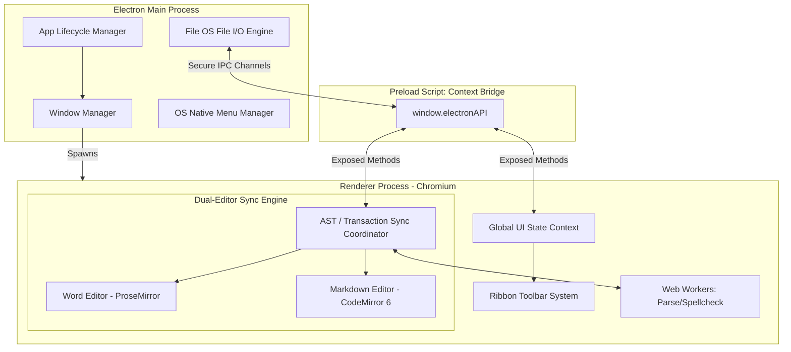
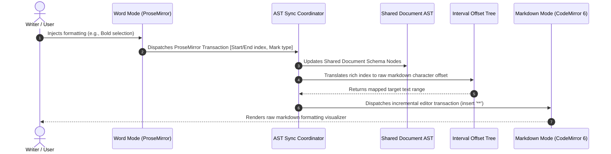

# ARCHITECTURAL BLUEPRINT: SUPERMD (A HIGH-FIDELITY HYBRID MARKDOWN WORD PROCESSOR)

An enterprise-grade, Electron-based desktop application architecture that merges the power of an extensible markdown engine with the high-fidelity WYSIWYG capabilities of a premium word processor like Microsoft Word.

---

## 1. Executive Summary & Product Vision

### The Paradigm Shift
Traditional markdown editors separate editing from previewing (split-screen) or offer simple "live previews" that lose markdown syntax visibility. Conversely, heavy word processors like Microsoft Word lock content into complex, proprietary formats (`.docx`).

**SuperMD** bridges this divide by establishing **Markdown (`.md`) as the single source of truth** while presenting the user with two synchronized, world-class interfaces:
1. **Word Processor Canvas ("Word Mode"):** A rich, paginated WYSIWYG editor featuring a responsive MS Word-style **Ribbon Interface**, A4 page-by-page emulation, custom margins, and inline drag-and-resize elements.
2. **Structure & Code Editor ("Markdown Mode"):** A professional developer-grade IDE environment (built with CodeMirror 6) with syntax highlighting, line numbers, folding, invisible characters, and real-time AST sync.

The engineering challenge is maintaining **100% roundtrip fidelity**—ensuring that format actions, shortcuts, and real-time edits instantly sync between both editors without losing custom configurations, HTML blocks, or syntax subtleties.


---

## 2. Core Architectural Principles

To ensure SuperMD performs with speed, stability, and scalability, it adheres to the following tenets:

*   **Process Isolation:** The Main process handles OS integrations (I/O, Menus, Dialogs, Window management). The Renderer process handles the UI. A secure, minimal IPC Bridge binds them.
*   **AST-Driven State Synchronization:** Synchronization is not done through fragile string diffing. We parse the document into an Abstract Syntax Tree (AST). Changes in either view update this central, stateful memory buffer.
*   **Zero Main-Thread Blocking:** File serialization, PDF rendering, and complex Markdown parsing occur asynchronously without blocking the UI thread.
*   **System Native Integration:** The app integrates deeply with the operating system, supporting system file dialogues, custom hotkeys, and hardware-accelerated rendering.

---

## 3. Technology Stack Selection

The stack has been carefully selected to match industry-standard desktop engineering:

| Layer | Technology | Justification |
| :--- | :--- | :--- |
| **App Core** | **Electron + Node.js** | Provides native desktop window management, direct OS integration, high-performance IPC, and system-level file access. |
| **Renderer Framework** | **React (TypeScript)** | Enables a highly responsive, component-driven UI for the complex Ribbon toolbar and side panels. |
| **WYSIWYG Engine (Word Mode)** | **ProseMirror + TipTap Core** | ProseMirror is a structured, document-schema-based editor. It avoids standard contentEditable bugs and provides direct AST mapping. |
| **Code Editor (Markdown Mode)**| **CodeMirror 6** | A modern, highly extensible text editor designed for mobile and desktop browsers. Much lighter than Monaco, with better touch support and custom theme integrations. |
| **Markdown Parsing/AST** | **unified.js / remark** | The industry standard for parsing Markdown to an AST (mdast), allowing structural mutations and exact HTML/Markdown serialization. |
| **Styling & Theme Engine** | **Vanilla CSS Variables + HSL Colors** | Allows dynamic theme switching (Light, Dark, Sepia, Solarized) with hardware-accelerated CSS custom properties. |
| **Export Services** | **Chromium printToPDF + Word XML** | Enables high-fidelity conversion of Markdown to MS Word (`.docx`) and native PDF generation using headless Chromium printing. |

---

## 4. System & Process Architecture

### Process Separation Map
We follow the strict security guidelines of Electron: `contextIsolation: true`, `nodeIntegration: false`, and a hardened Content Security Policy (CSP).



---

## 5. Dual-Editor AST Synchronization Engine

The biggest failure point in dual-view editors is **desynchronization and cursor jump**. If you modify text in Word Mode, the cursor in Markdown Mode must not reset to the beginning of the file, and vice versa.

### The AST Transaction Protocol
To achieve seamless bidirectional synchronization:
1. **The Shared Document Model:** We represent the document as an in-memory ProseMirror Document AST.
2. **Transaction Mapping:** When a change occurs in ProseMirror, it generates a transaction detailing exactly *what* changed and *where* (offset, inserted/deleted nodes).
3. **AST to Markdown Conversion:** The sync engine uses a specialized renderer to transform the ProseMirror document AST into a clean Markdown string.
4. **Incremental CodeMirror Update:** Instead of replacing the entire CodeMirror content, we apply transactions incrementally.



### Position Mapping Algorithm
We maintain a coordinate mapping index. Because markdown syntax adds extra characters (e.g., `**` for bold), character offsets in Markdown Mode are offset relative to Word Mode. The sync engine maps every node in the ProseMirror AST to a character range in the CodeMirror editor. This guarantees that when the user moves their cursor in Word Mode, the Markdown cursor tracks to the exact corresponding position in the raw code.

---

## 6. UI/UX Design Architecture: The MS Word Experience

The user interface is designed to emulate the polished, structured layout of Microsoft Word, combined with the sleek, modern styling and developer convenience of VS Code.

### Aesthetic Design System
We implement a high-fidelity visual experience using custom CSS variables, layout resets, and custom scrollbars:

*   **Aesthetic Theme Customization:**
    *   *Default Light (Classic Word):* Deep indigo primary accent (`#2b579a`), soft gray canvas backdrop (`#f3f2f1`), clean white document page with subtle shadows (`0 4px 16px rgba(0,0,0,0.08)`).
    *   *Dark Mode (Developer Office):* Dark slate grey canvas backdrop (`#1e1e1e`), pitch black pages (`#121212`), high contrast muted white text, soft cyan/violet accents.
    *   *Solarized/Sepia:* For reading comfort.
*   **Acrylic Glassmorphism:** Headers, Ribbon toolbars, and side panels use backdrop filters (`backdrop-filter: blur(12px) saturate(180%)`) to blend into the operating system's background when customized.
*   **Micro-Animations:** Butter-smooth transitions (`cubic-bezier(0.4, 0, 0.2, 1)`) for tab switching, sidebar toggles, and popups.

### The Word Ribbon Toolbar System
We structure the Ribbon interface with specific tabs, groups, and controls using React components:

```
┌────────────────────────────────────────────────────────────────────────────────────────┐
│  File   [Home]   Insert   Layout   References   View   Settings              [ SuperMD ]   │
├────────────────────────────────────────────────────────────────────────────────────────┤
│ ┌───────────────┐ ┌───────────────────┐ ┌───────────────┐ ┌──────────────┐ ┌─────────┐ │
│ │  Paste  [Cut]  │ │ Arial     │ 11  ▲ │ │  B   I   U   │ │   Align Left │ │ Find    │ │
│ │ ┌───────────┐ │ │ ┌─────────┴─────┐ │ │ ┌───┬───┬───┐ │ │ ┌───┬───┬───┐ │ │ Replace │ │
│ │ │ Clipboard │ │ │ │ Font          │ │ │ │   │   │   │ │ │ │   │   │   │ │ │ Select  │ │
│ └─┴───────────┴─┘ └─┴───────────────┴─┘ └─┴───┴───┴───┴─┘ └─┴───┴───┴───┴─┘ └─┴─────────┘ │
│    Clipboard            Font                Style            Paragraph       Editing   │
└────────────────────────────────────────────────────────────────────────────────────────┘
```

The Ribbon layout comprises the following functional divisions:
1.  **Home Tab:**
    *   *Clipboard:* Copy, Paste, Format Painter.
    *   *Font:* Font Family, Size, Bold (`**`), Italic (`*`), Underline (`<u>`), Strikethrough (`~~`), Subscript/Superscript (`<sub>`/`<sup>`), Text Highlight Color (`<mark>`).
    *   *Paragraph:* Left/Center/Right alignments, Line Spacing, Unordered List (`-`), Ordered List (`1.`), Indentations.
    *   *Styles:* Quick access to markdown headers (H1, H2, H3), blockquotes, code-blocks.
2.  **Insert Tab:**
    *   *Tables:* Interactive visual grid selector. Creates structured HTML/Markdown tables.
    *   *Illustrations:* Drag-and-drop or local file browser images. Converts images to local relative paths and writes normal markdown image links.
    *   *Links & Bookmarks:* Markdown hyperlinks and anchor links.
    *   *Symbols & Math:* Inline or Block LaTeX equations (`$ equation $` or `$$ equation $$`).
    *   *Diagrams:* Live Mermaid.js diagram inserts.
3.  **Layout Tab:**
    *   *Page Setup:* Margins (Normal, Narrow, Wide), Page Breaks (`---`).
4.  **View Tab:**
    *   *Layout Toggles:* Word Canvas Mode Only, Markdown Editor Only, or Split View.
    *   *Distraction-Free Mode:* Fullscreen canvas layout with all side panels and toolbars dynamically collapsed.
5.  **Settings Tab:**
    *   *Shortcut Manager:* Complete keyboard shortcut configurations. Users can select any action (e.g. Save, Undo, Bold, Redo) and rebind it by typing their new hotkey combinations into a custom overlay modal, stored persistently in application settings.

---

## 7. Deep Architecture Spec for Word Canvas Mode

### The A4 Page Emulator
To feel like Microsoft Word, the WYSIWYG editor canvas must not just be a scrolling web page; it must render simulated sheets of paper with physical margins.
*   **Virtual Emulation:** We create a container div simulating the Page Wrapper (`.supermd-page`).
*   **Marginal Layouts:** Supports Narrow, Normal, and Wide margin classes that instantly adjust page layout padding.
*   **Page Boundary Aesthetics:** Emulates physical pages with box shadows, margin breaks, and realistic printable area structures.

```css
.supermd-canvas {
  background-color: var(--canvas-bg);
  display: flex;
  flex-direction: column;
  align-items: center;
  padding: 40px 0;
  overflow-y: auto;
}

.supermd-page {
  background-color: var(--page-bg);
  width: 210mm; /* A4 Width */
  min-height: 297mm; /* A4 Height */
  padding: 25mm; /* Page margins */
  margin-bottom: 20px;
  box-shadow: 0 4px 20px rgba(0, 0, 0, 0.05);
  position: relative;
  box-sizing: border-box;
}
```

---

## 8. Deep Architecture Spec for Markdown Mode

### CodeMirror 6 Configurations
Markdown mode acts as a developer-grade text editor configured to present structural clarity.
*   **Syntax Highlighting:** Integrated with `@codemirror/lang-markdown` utilizing Lezer-based parsing to ensure high-performance incremental syntax styling.
*   **Visual Enhancements:**
    *   *Line Numbers & Folding:* Standard folding of header sections and block elements.
    *   *Invisible Characters:* Toggleable rendering of spaces, tabs, and line endings.
    *   *Active Line Highlight:* Highlights the current line.

---

## 9. Advanced Processor Features

### Local Spellcheck & Grammar Engine
Instead of utilizing cloud services, spellchecking is executed locally:
*   **Electron Spellchecker Engine:** Integrates Chromium's built-in spellchecking, resolving spelling using the native OS API on Windows and macOS.
*   **Context Menu Overlay:** Right-clicking misspelled words lists spelling suggestions.

### Background Mermaid.js Diagram Engine
To combine the structural power of Markdown with the rich visual experience of Microsoft Word, SuperMD features a native compiler for rendering Mermaid diagrams:
*   **The Custom ProseMirror Extension (`MermaidExtension`):**
    *   In **Word Mode**, when the markdown parser encounters a code block marked with the `mermaid` language tag, it mounts a custom React-based NodeView inside the ProseMirror editor frame.
    *   This NodeView runs `mermaid.render()` **asynchronously in the background** to transform the raw text graph definitions into highly optimized, responsive vector SVGs (`.svg`).
*   **Interactive Editing Cards:**
    *   Double-clicking a diagram in Word Mode launches a sleek, floating glassmorphism control card.
    *   This card allows writers to make rapid code tweaks to the diagram directly from the WYSIWYG screen, featuring live syntax validation, and choose preset templates (Flowchart, Sequence Diagram, Gantt Chart, pie chart, etc.).

### High-Fidelity Export Pipeline
SuperMD features a comprehensive dual-export pipeline designed for professional production:

*   **PDF Export Engine:**
    *   Main process creates an off-screen `BrowserWindow` with A4 dimensions (794x1123px).
    *   Applies print stylesheet overrides (`@media print`), margins (0.6" top/bottom, 0.7" left/right), and a 1.5s delay to allow async images, fonts, and diagrams to finish rendering.
    *   Injects a KaTeX CDN link for native formula printing, formatting code blocks, bullet points, checklists, and Mermaid SVGs perfectly.
*   **MS Word Exporter (`.docx`):**
    *   Uses a native IPC handler in the main process to compile the rich editor HTML into a valid Office Open XML-compatible format.
    *   Wraps document content in an MHTML envelope containing proper Microsoft namespaces (`xmlns:o`, `xmlns:w`) and Word settings (`w:WordDocument` for standard Print layout).
    *   Pre-packages font styling (Calibri), exact page dimensions, and Word-compliant stylesheets so the document looks perfectly formatted when opened natively in MS Word.

---

## 10. Bug Fixes & Resilience Specs

### Stale View Guard (Editor Unmount Crash Prevention)
In modern single-page-applications, when React unmounts a view, references to the underlying DOM or instance view variables can linger.
*   **The Issue:** When a new file was opened, the `fileVersion` state incremented to remount `<WordEditor>`. During this transition, global keyboard listeners and diagnostics panels accessed `editorInstance.view.focused` or `editorInstance.state` which in Tiptap v3 threw an uncaught error.
*   **The Solution:** All global/external references to `editorInstance` are protected by `.isDestroyed` guards and wrapped inside `try-catch` blocks. If the editor view is destroyed or unmounting, it fails silently, avoiding UI crashes.

### ProseMirror Atom Node Spec Fix
ProseMirror schemas specify node rules.
*   **The Issue:** Standard Tiptap specs for leaf nodes (`atom: true`, such as inline LaTeX `mathInline` and diagram `mermaidCode`) returned a content hole (`0`) in their `renderHTML` return arrays: `['div', { ... }, 0]`. When Tiptap called `.getHTML()` on these nodes during HTML serialization (such as during PDF/DOCX exports), it threw `Content hole not allowed in a leaf node spec`.
*   **The Solution:** Removed the `0` hole from both `MathInlineExtension` and `MermaidExtension` schemas, enabling seamless, crash-free, standard-compliant HTML compilation and export execution.

---

## 11. Running and Building the App

To run SuperMD locally:

```bash
# Install dependencies (Yarn is preferred)
yarn install

# Start the Electron development server
yarn dev

# Compile TypeScript types
yarn tsc -b
```
